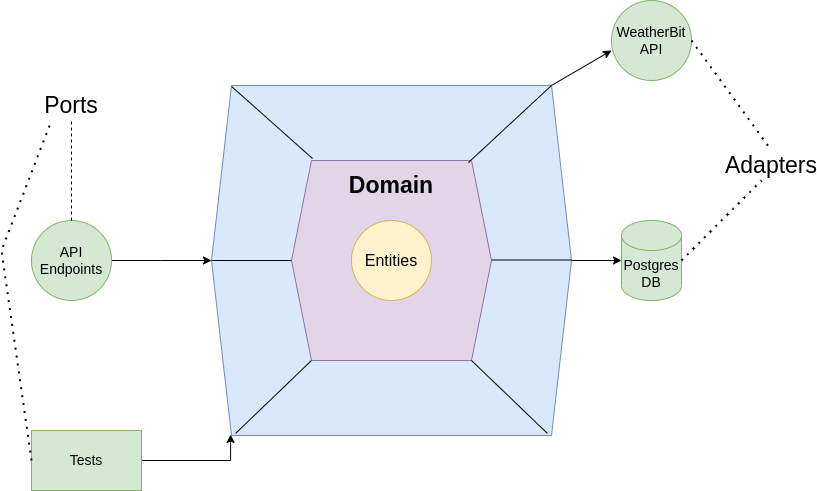

# Where is my package??

## Description
This is an implementation of an API challenge to track parcels, it enables end users 
(receiver of a shipment) to monitor the status of their shipment.
This solution is done in a python Flask based Backend API that serves shipment data and provides users 
with current weather conditions at their location. 

For shipments, I am using some seed data and storing it in a Postgres database.
As for the weather information data, API calls are made to [WeatherBit](https://www.weatherbit.io/api/weather-current).

## Architecture



For this application I have used hexagonal architecture as seen above. It is a software design pattern that promotes a clear separation
of concerns and dependencies within an application.

In our Flask application following this architecture, the core idea is to isolate the business logic and domain model 
from the external dependencies such as frameworks, databases, and third-party services. This allows for easier testing, maintainability, and flexibility of the application.

Here's a breakdown of the key components of our application:

**1. Domain Layer:** 

    This layer represents the core of the application and contains the business logic and domain model, which in our case is fetching shipment data with weather information. 
    It defines the entities, use cases, and rules that we are going to be using to accomplish this task. This layer is independent of both the Postgres DB and the 
    WeatherBit API repository, allowing it to be easily testable and reusable.


**2. Adapters:**

    The Adapter is the part of our code which contains repositories, i.e. the logic for the Postgres database and the WeatherBit API access. It also contains the caching mechanism, which
    is provided by using flask-caching, so that we only make external API calls if our cache data for the same input is expired, which happens every 2 hours.

**3. Controller:** 

    This layer contains the entry points into the application from the external world. In this application, the input ports are defined as Flask 
    routes and endpoints. They handle the incoming HTTP requests, validate the input, and invoke the appropriate use cases.


## Requirements

1. [Docker](https://www.docker.com/)
2. [Docker Compose](https://docs.docker.com/compose/install/)
3. make (might be pre-installed if you are using a linux distribution or macOS)

## How it works

The application, and the postgres database are containerized with docker and docker-compose. Therefore, there is no need to install pesky libraries and tools as long as the above 
mentioned requirements are met.

I have also created a makefile so that there is no need to deal with the commands for docker and docker-compose. Following are the different commands that will be used to run the 
appilcation.

### Get Help for all the make commands
This section will give you a list of all make commands available and what they do. Just remember to run them from the root directory of the project.


```shell
make help
```

### Run the application
This commands does several steps including
1. Creates and starts the postgres db container
2. Seeds the db 
3. Creates and starts the flask app

```shell
make run
```

After this command is executed, you can now make API request to http://127.0.0.1:8080 based on the openapi spec.

Disclaimer: Don't close the terminal in which you ran this command.

### Run tests
This command runs the unit and integration tests that are written using pytest

```shell
make test
```

### Stop all running containers and clean up
Stop both the running containers and do cleanup

```shell
make stop
```

## Endpoints and OpenAPI docs

There is only one end point provided which is to get shipment with weather information. This is defined in the [open_api_spec.yml](open_api_spec.yml) file.

You can also access the OpenAPI file in Swagger UI at http://127.0.0.1:8080/apidocs while the application is running.

## Discussion Points for the challenge

**Q1. What were the important design choices and trade-offs you made?**

While designing the application I took the following decision:

1. I used Flask as its a more lightweight framework than Django
2. The system was designed with hexagonal architecture as it provides
    1. Better testability 
    2. A proper separation of concerns
    3. Allows me to use multiple external data sources, both postgres and WeatherBit API with ease
3. Created Dockerfile and docker-compose so that this application can be run easily in any machine
4. Used makefile to properly arrange and facilitate the execution of the application and associated components
5. Postgres is used to store the seed data as the data is relational in nature
6. Used flask-caching for caching API calls to WeatherBit as it comes already integrated with flask
7. Used pytest for testing as it provides use of fixtures, has an easier syntax and is more versatile


**Q2: What would be required to deploy this application to production?**

A lot of steps are already done to deploy this application to production, this includes the containerization of the application.
Following steps are still pending to deploy this application to production:-
  - There is no Authentication/Authorization
  - There needs to be a cicd pipeline to run tests and facilitate proper functioning and deployment of the application
  - For better maintainance and auto update of the DB, a migration library should be used, like Flask-Migrate
  - A mechanism to hide the secrets
  - A distributed caching repository needs to be created, instead of flask-caching. Like redis. 


**Q3: What would be required to scale this application to handle 1000 requests per second?**

1. Use of an asynchronous library like celery to handle multiple requests at a time.
2. Horizontal scaling of the application using a cloud provider like AWS and orchestration platform like kubernetes.
3. Since a large amount of db requets are made, there needs to be the use of a more distributed Relational Database system like Amazon Aurora, RDS, etc.
4. There should be a load balancer between the user and the Application.
5. Utilize caching mechanisms like Redis to cache frequently accessed data and reduce the load on the database.
